```{=html}
<style>
.reveal .sourceCode pre,
.reveal .sourceCode code,
.reveal pre code {
  font-size: 0.6em; /* Adjust as needed */
}
</style>
```

<!-- type 's' for speaker view -->

## Outline

- Aims
- Data
- Health Economics
- Diagnostics
- Bayesian thinking
- Mechanistic modelling
- Conclusion

:::: fragment
::: callout-note
## Resources

Slides and code here: `github.com/n8thangreen/AMR-presentation`
:::
::::

::: notes
Brief introduction of yourself and your disciplines (Statistics & Health Economics).
The core message: You can engineer the perfect solution, but if we can't measure its impact or afford it, it won't be adopted.
:::

<!-- ##  -->

<!-- ::: panel-tabset -->

<!-- ## Tab 1 -->

<!-- Content for Tab 1. -->

<!-- ## Tab 2 -->

<!-- Content for Tab 2. -->

<!-- ::: -->

## Aims

- How does data analysis, modelling, and public health policy [intersect]{style="color: blue;"} in tackling antimicrobial resistance.

- Provide insight into [key concepts, challenges]{style="color: blue;"}, and [research directions]{style="color: blue;"} 
  - May encourage further interest and independent exploration.

- Develop a wide-ranging understanding of the AMR landscape

  - Preventing Infections
  - Diagnostics and Surveillance
  - Novel Therapies

## Some Relevant Modelling

- Infectious disease modelling
- Survival analysis
- Probabilistic simulation
  - Cohort model (Markov model)
  - Discrete Event Simulation (DES)
  - Microsimulation etc
- Cost-effectiveness modelling, sensitivity analysis
- Missing data, linked data sets
- Causal inference

#

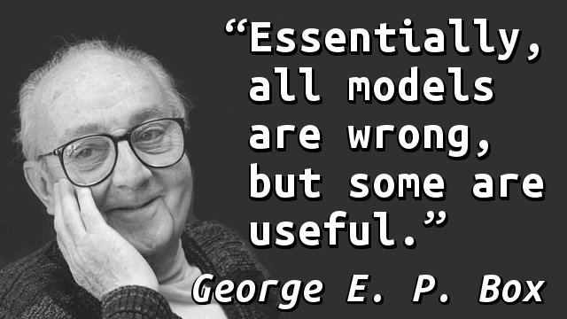

<!-- ::::: columns -->
<!-- ::: {.column width="50%"} -->
<!--  -->
<!-- ::: -->

<!-- ::: {.column width="50%"} -->
<!--  -->
<!-- ::: -->
<!-- ::::: -->

# Data

## Overview

### What data should we look for?
* The role of **conceptual models**

### Where will we **find** it?
* **Sources** and **forms** of data
* **Searching** for data
* **Selecting** data

### What do we **do** with it?
* Evidence synthesis
* Data transformation

## Steps for reviewing and using relevant data

1. Consider how parameters [relate to each other]{style="color: blue;"} and group them

. . .

2. For each group, consider appropriate data sources

. . .

3. Critically assess the [quality]{style="color: blue;"} of the data sources

. . .

4. Take into consideration the different [hierarchies of evidence]{style="color: blue;"}

## Critical assessment of data sources

Questions to consider.

1. Primary vs. secondary data?
2. Randomised vs. observational data?
3. Aggregate statistics vs. individual patient data?
4. When collected?
5. Sample size
6. Heterogeneity, case mix

## Hierarchy of evidence pyramid

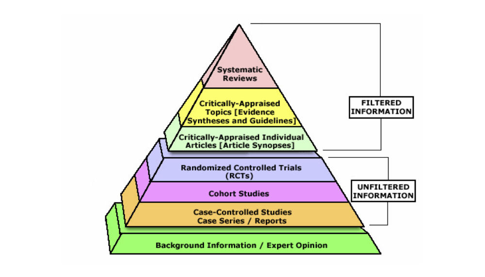

## The Global and Local Data for AMR

::::: columns
::: {.column width="50%"}
- **Global level:** WHO GLASS (Global Antimicrobial Resistance and Use Surveillance System).

- **National level:** UKHSA (UK Health Security Agency), ESPAUR reports.

- **Local/Clinical level:** Hospital Electronic Health Records (EHRs), Laboratory Information Management Systems (LIMS).

- **The Surveillance Dichotomy:**
  - *Passive Surveillance:* Waiting for routine clinical samples (cheap, scalable, but biased).
  - *Active Surveillance:* Deliberately swabbing populations or environments (comprehensive, but expensive and resource-intensive).
:::

::: {.column width="50%"}


:::
:::::

::: notes
Emphasize to the engineers that their devices will eventually need to plug into these exact data streams. A brilliant point-of-care test is useless if it can't transmit its findings back to the EHR or UKHSA.
:::


## Messy, Noisy Data
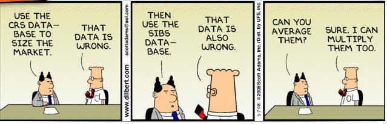 

## Messy, Noisy Data

- **Selection Bias:** May mainly culture samples from patients who are severely ill or failing first-line therapy

- **Missingness & Fragmentation:**
  - Rubin's classification: Missing **Completely** At Random (MCAR), Missing At Random (MAR), Missing **Not** At Random (MAR)

- **Temporal Lags:** E.g. The delay between infection onset, laboratory culturing, and reporting

- **The Prediction Problem:** High dimensionality

## Texas Sharpshooter Fallacy

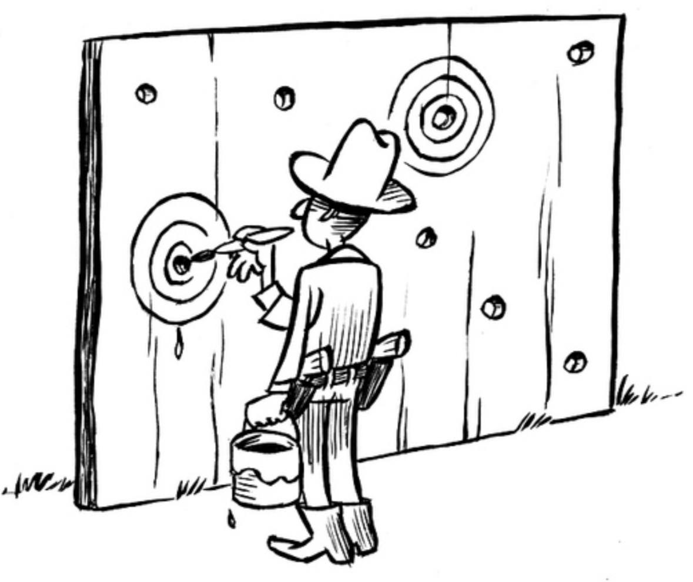

## Selection Bias

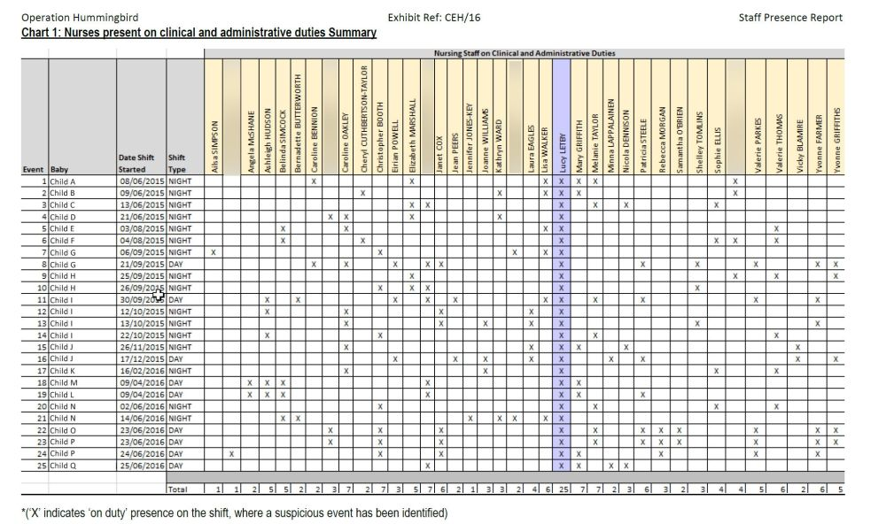

:::notes
1. The Texas Sharpshooter Fallacy
This fallacy occurs when someone highlights similarities in data but ignores the differences, effectively drawing a "bullseye" around a cluster of bullet holes after the shots have already been fired.

In this case: Critics argue that the chart only included the specific deaths and collapses that the prosecution deemed "suspicious." If the definition of a "suspicious" collapse was influenced (even subconsciously) by the fact that Letby was on duty, the chart becomes a self-fulfilling prophecy.

2. Omitted Variable Bias (The Missing Denominator)
To prove a statistical anomaly, you need the full picture. The roster presented to the jury showed Letby present for 100% of the charged incidents.

The missing data: The chart did not show the overall number of deaths or collapses on the neonatal unit during that period, nor did it show the incidents that occurred when Letby was not on shift. Without knowing the total number of events or comparing the rate of incidents during her shifts to the rate during other nurses' shifts, the chart lacks statistical validity.

3. Exposure and Shift Patterns
Letby reportedly worked a high number of shifts, including many extra shifts to cover staff shortages, and possessed specialist training that meant she was assigned to the sickest babies.

The statistical reality: If a nurse works significantly more hours than their colleagues—especially in an intensive care setting with highly vulnerable patients—they will naturally be present for a higher absolute number of tragic incidents. The data on the chart did not control for the number of hours worked or the acuity (sickness level) of the patients she was assigned to.

4. Cluster Illusion
Human brains are wired to find patterns, even in random data. In any hospital unit dealing with critically ill infants, mortality rates can spike due to sheer random chance, hospital-wide infections, understaffing, or systemic failures. When a spike happens, looking for a common denominator (like a specific staff member) can lead to false correlations
:::


## Predicting is hard
  
- _"Those who have knowledge, don't predict. Those who predict, don't have knowledge."_   
  — Lao Tzu (Philosopher)


- _"People can come up with statistics to prove anything, Kent. Forty percent of all people know that."_
  — Homer Simpson

##

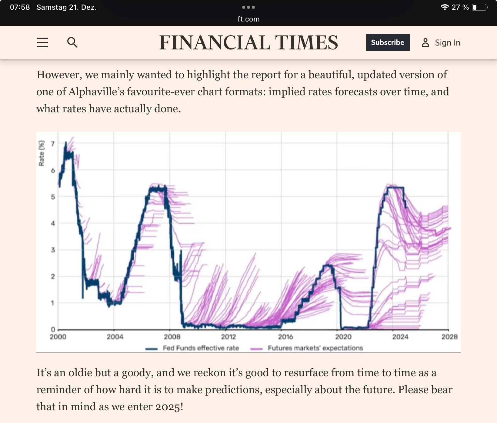

## What can we do about it?

- Multiple imputation

- Bayesian modelling

- Combining multiple data sets
  - Mutiparameter evidence synthesis (MPES)
  - (Post) Stratification
  - (Network) meta-analysis (NMA)
  - Extrapolation
  - ...

## Survival curve extrapolation
@Latimer2022

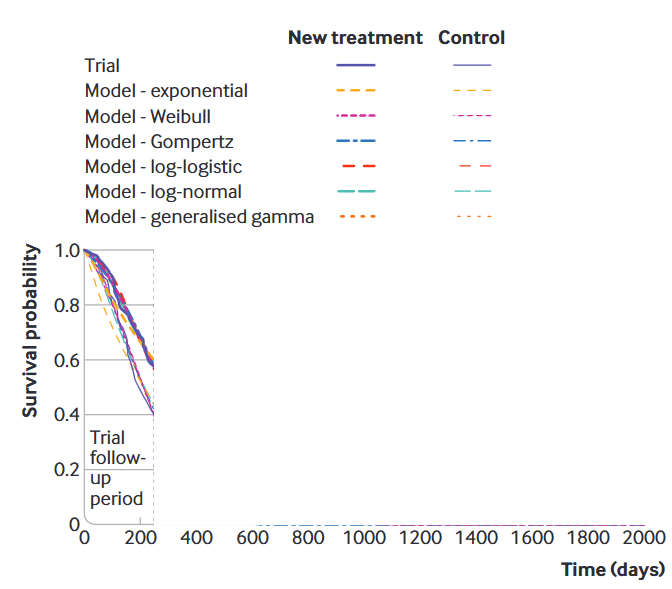

## Survival curve extrapolation
@Latimer2022

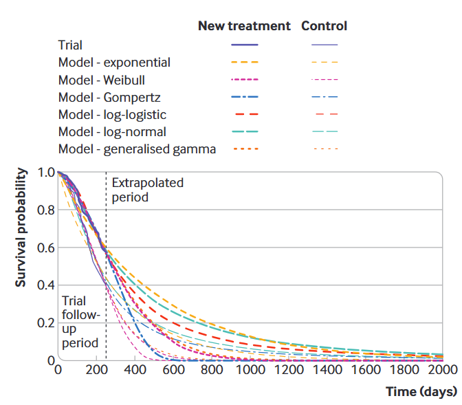

## NMA

@Jenkins2021

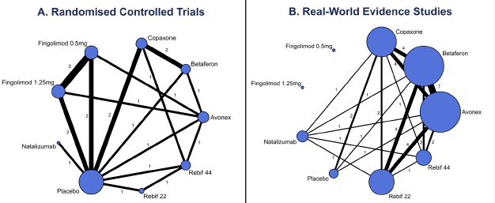

# Health Economics of AMR

## Health Economic Evaluation (HEE) / Health Technology Assessment (HTA)

- **Goal:** Maximize population health under a strictly constrained budget.

- **ICER (Incremental Cost-Effectiveness Ratio):**
  - $\text{ICER} = \frac{\text{Cost}_{\text{new}} - \text{Cost}_{\text{standard}}}{\text{Effect}_{\text{new}} - \text{Effect}_{\text{standard}}}$

- **Cost-Effectiveness Plane:** Plotting $\Delta\text{Cost}$ against $\Delta\text{Effect}$

- **Willingness to Pay Threshold:** How bodies like NICE (National Institute for Health and Care Excellence) make decisions. Historically, the NHS threshold is £20,000 – £30,000 per QALY gained.

## Recent change in theshold

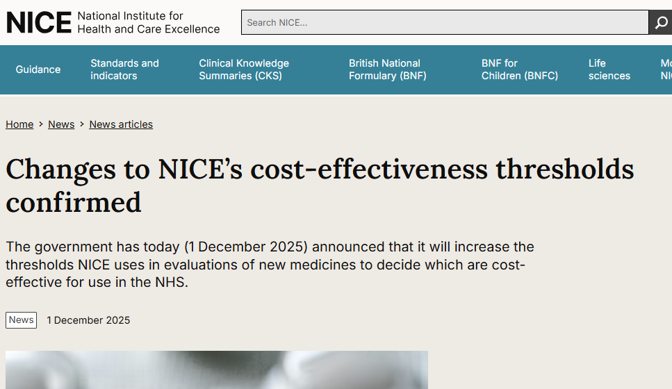

## Recent change in theshold


## Measuring the Burden

- **QALYs (Quality-Adjusted Life Years):** Measures health gain ($1 \text{ QALY} = 1 \text{ year in perfect health}$).

- **DALYs (Disability-Adjusted Life Years):** Measures health loss (Years of Life Lost + Years Lived with Disability).

- **Direct Healthcare Costs:** Prolonged hospital stays, intensive care bed days, expensive last-resort antibiotics.

- **Indirect Societal Costs:** Lost productivity, macroeconomic impacts, and the "insurance value" of antibiotics (enabling surgeries, chemotherapy).

::: notes
Engineers usually think about the cost of manufacturing their device. You need to shift their perspective to the cost of *not* having their device. Mention the "insurance value"—antibiotics underpin all modern medicine.
:::

##

@RuizRamos2017

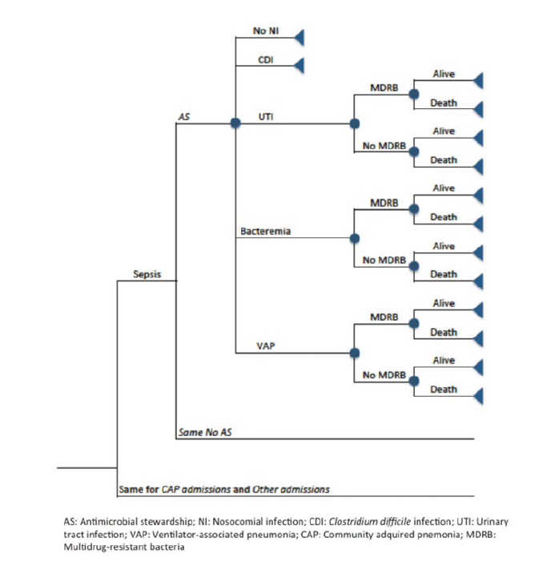

##

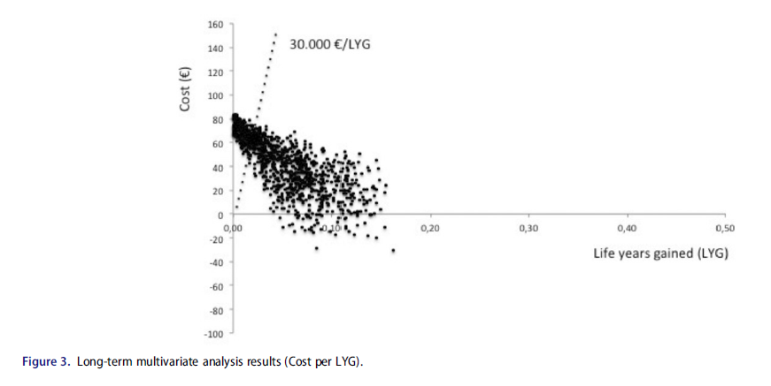

## Deterministic Sensitivity Analysis (DSA) 

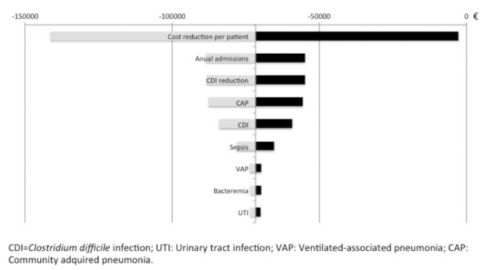

## Probablistic Sensitivity Analysis (PSA) 

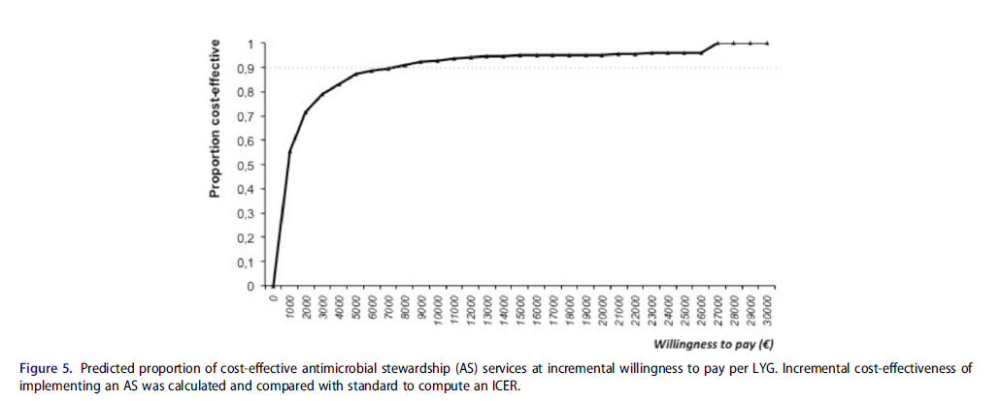

# BREAK :smile:

# Diagnostics

## Statistical Analysis of Diagnostics

- **Clinical Reality:** A rapid test is only as good as the clinical action it prompts.

- **Inherent Properties:** [Sensitivity]{style="color: blue;"} (true positive rate) and [Specificity]{style="color: blue;"} (true negative rate).

- **Real-World Performance:** Positive/Negative Predictive Values (PPV/NPV).

- PPV is highly dependent on *background prevalence*. 
  - Highly specific device can still yield mostly false positives if deployed in a low-prevalence population!

## Fundamental classification statistics

* **True positive (TP)**: Number of correct predicted positives.

. . .

* **True negative (TN)**: Number of correct predicted negatived.

. . .

* **False positive (FP)**: Number of incorrect predicted positives. Equivalent with Type I error.

. . .

* **False negative (FN)**: Number of incorrect predicted negatives. Equivalent with Type II error.

## Contingency tables

| | True Positive (p) | True Negative (n) | Total |
| :--- | :---: | :---: | :---: |
| **Test Positive (p')** | True Positive (TP) | False Positive (FP) | **P'** |
| **Test Negative (n')** | False Negative (FN) | True Negative (TN) | **N'** |
| **Total** | **P** | **N** | |

## Contingency table summary statistics

* **Sensitivity** $= p(T|D) = \frac{TP}{TP+FN}=\frac{TP}{P}$

* **Specificity** $= p(T^c|D^c) = \frac{TN}{FP+TN}=\frac{TN}{N}$

* **Prevalence** $= \frac{TP+FN}{M}=\frac{P}{M}$

* **Positive predictive value (PPV)/precision** $= p(D|T) = \frac{TP}{TP+FP}$

* **False discovery rate (FDR)** $= 1-PPV = p(D^c|T) = \frac{FP}{TP+FP}$

* **Negative predictive value (NPV)** $= p(D^c|T^c) = \frac{TN}{FN+TN}$

* **False omission rate (FOR)** = 1-NPV $= p(D|T^c) = \frac{FN}{FN+TN}$

* **Accuracy** $= \frac{TP+TN}{M}$

## Contingency table summary statistics

Notice that the PPV and NPV depend on the prevalence. We can alternatively compute them using:

* **PPV** = 
$$
\frac{sensitivity \times prevalence}{sensitivity \times prevalence + (1- specificity) \times (1-prevalence)}
$$

* **NPV** =
$$
\frac{specificity \times (1-prevalence)}{(1-sensitivity) \times prevalence + specificity \times (1-prevalence)}
$$

## How to compare the performance of diagnostic tests?

* Dichotomous test (only 2 results)

. . .

  * Odds ratios
  * Likelihood ratios
  * Sensitivity specificity, PPV, NPV

. . .

* Multilevel level ($>2$ results)

. . .

  * Receiver operating characteristic curve (ROC)

## Receiver operating characteristic curves (ROC)

* TP rate (sensitivity) on vertical axis and FP rate (1-specificity) on horizontal, for varying classification threshold.
* Illustrates the [trade-off]{style="color: blue;"} between sensitivity and specificity.
* A single curve summary of the information in the cumulative distribution functions of the scores of the two classes.
* c.f. *ROC Curves for Continuous Data*, Krzanowski and Hand (2009).

## {data-menu-title="Normal Classifier"}

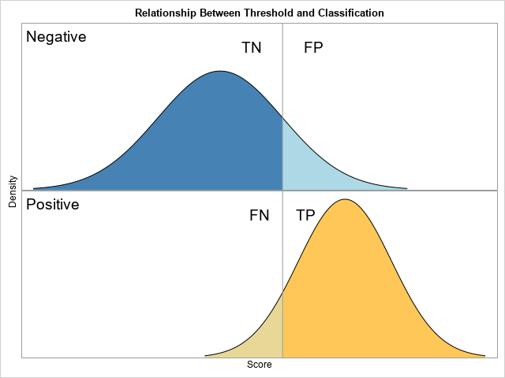{fig-align="center"}

## {data-menu-title="ROC Examples"}

@Krzanowski2009

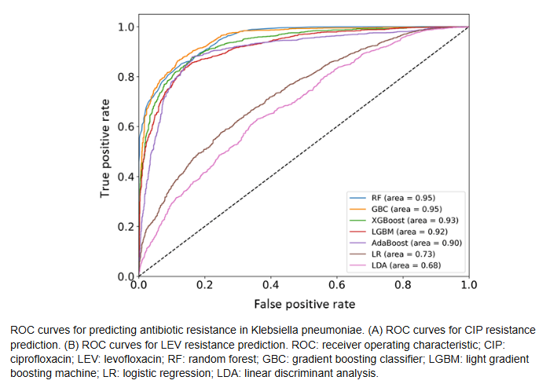{fig-align="center"}

# Bayesian Thinking

## Frequentist vs. Bayesian:*

- *Frequentist:* The true rate of AMR is fixed; our data is a random sample.
- *Bayesian:* Our *belief* about the rate of AMR is a probability distribution, which we update as we get new data.
- Start with a [prior]{style="color: blue;"} belief, observe new evidence (e.g., from your engineered biosensor), and update to a [posterior]{style="color: blue;"} belief.
- Diagnostic devices do not give absolute answers; they provide *evidence* that shifts a clinical probability.

::: notes
Engineers are used to dealing with noisy sensors. Frame the clinical environment the same way. The doctor has a "noisy" guess about what bug the patient has (the prior). The engineer's new biosensor provides a new signal (the likelihood).
:::

## Bayes' Theorem for Diagnostics

- **The Equation:** $$P(\text{AMR}|\text{Positive Test}) = \frac{P(\text{Positive Test}|\text{AMR}) \cdot P(\text{AMR})}{P(\text{Positive Test})}$$

- **Breaking it down:**
  - $P(\text{AMR}|\text{Positive Test})$: **Posterior** (What the clinician actually wants to know—the PPV).
  - $P(\text{Positive Test}|\text{AMR})$: **Likelihood** (Your device's Sensitivity).
  - $P(\text{AMR})$: **Prior** (Background prevalence of this resistant bug in this specific hospital).
  - $P(\text{Positive Test})$: **Marginal Likelihood** (Probability of the device firing positive at all).


## Denominator Bias

- **False Positive Paradox:** Let's say you engineer a biosensor that is $99\%$ sensitive and $99\%$ specific.

- You deploy it in a general ward where the prior probability (prevalence) of a specific AMR strain is only $1\%$.

- **Reality Check:** If the alarm rings, what is the probability the patient actually has the resistant bug?
  - It's only $50\%$. Half of your alarms will be false positives.

- **Takeaway:** Engineering a highly accurate device is not enough. If you deploy it in the wrong clinical context (the wrong prior), e.g. over-prescription of antibiotics, and ultimately fail HTA evaluation.

::: notes
Walk them through this math out loud if there's time. 
Out of 10,000 patients, 100 actually have the bug. The test correctly flags 99 of them.
9,900 do NOT have the bug. The test incorrectly flags 1% of them = 99 false positives.
So you have 99 true positives and 99 false positives. Total positive alarms = 198.
99 / 198 = 50% PPV.
Watch their minds blow when they realize their 99% accurate sensor is wrong half the time!
:::

# Mechanistic Modelling

##

- **Challenge:** We cannot wait 10 years for a clinical trial to prove a new technology reduces AMR at the population level.
  - Indirect interactions
  - Mass action
  
:::notes
assumes individuals in a population mix randomly and uniformly, where the rate of new infections is proportional to the product of susceptible and infectious individuals.
:::

- **Mechanistic Models (Transmission Dynamics):** - Adapting SIR (Susceptible-Infected-Recovered) models to hospital wards.
  - E.g. simulating how a rapid diagnostic cuts the chain of transmission.

##

```{mermaid}
flowchart LR
    S([Susceptible]) -->|Infection| I([Infectious])
    I -->|Recovery| R([Recovered])
    
    classDef default fill:#f9f9f9,stroke:#333,stroke-width:2px;
    classDef sClass fill:#add8e6;
    classDef iClass fill:#ffb6c1;
    classDef rClass fill:#90ee90;
    
    class S sClass;
    class I iClass;
    class R rClass;
```

## 

@Durazzi2023

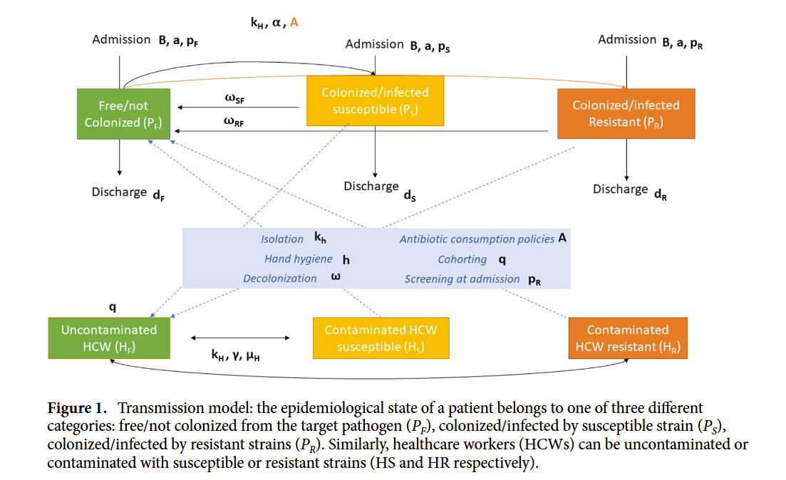

## System of differential equations

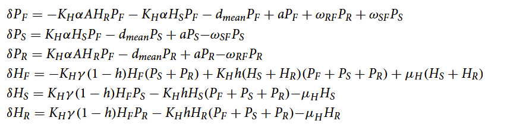 


## A comment on AI
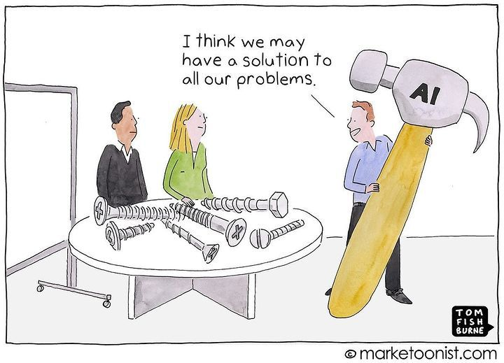 

## Mentimeter

brief quiz (3–5 multiple-choice or short-answer questions)

## Conclusions

- Models can [describe]{style="color: blue;"}, [explain]{style="color: blue;"} and [predict]{style="color: blue;"}
  - Machine learning are more black box and designed for prediction

- **Value is multifaceted:** Cost-effectiveness, not just clinical efficacy

- **Engage early:** Engineers, statisticians, and health economists must collaborate [during]{style="color: blue;"} the design phase of a technology, not just at the end.

- _"To consult the statistician after an experiment is finished is often merely to ask him to conduct a post mortem examination. He can perhaps say what the experiment died of."_
  — Ronald A. Fisher (Presidential Address to the First Indian Statistical Congress, 1938)

## 

# Thanks :thankyou:

## References

<!-- install.packages("pagedown") -->

<!-- pagedown::chrome_print("myslides.html") -->
